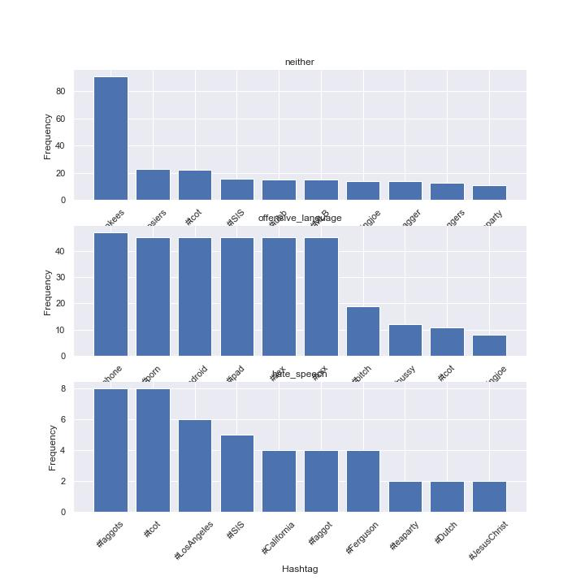

# Twitter-Hate-Speech-Detection

This is a take home assignment and the task is to classify the tweets into three classes, 1. Hate Speech, 2. Offensive Language and 3. Neither.

Common definition of hate speech:

Hate speech refers to any form of communication, such as words, gestures, or images, that expresses hostility or prejudice towards an individual or a group of people based on their race, ethnicity, nationality, religion, gender, or any other characteristic.

Common definition of offensive language:

Refers to any form of communication that is considered inappropriate, insensitive, or disrespectful.

Data Exploration 

Top 10 hashtag per class

Top 20 Most Frequent Tokens per class

